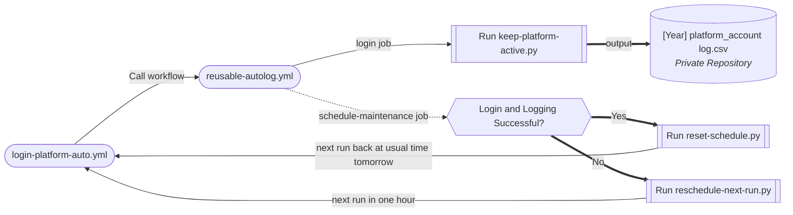
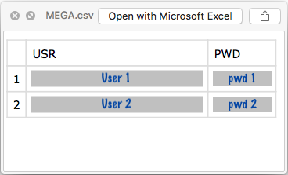
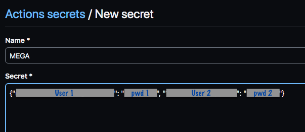
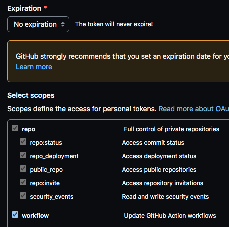
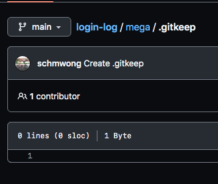
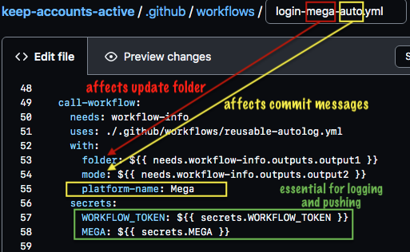
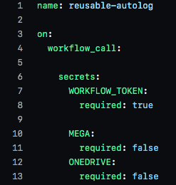
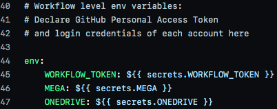

# Automated Login Scripts to Keep Accounts Active

## Objective

Cloud service providers have been known to delete the contents of personal accounts or 
close the accounts themselves after a period of inactivity, sometimes without the end-user's knowledge.
This project aims to prevent that from happening by automating logins at regular intervals.

Each login process is recorded in a csv log file. 
Because it contains personally identifiable information, this log file is saved to a private repository.

```
.
├── mega/
│   ├── [2021] mega_1 log.csv
│   ├── [2021] mega_2 log.csv
│   ├── [2022] mega_1 log.csv
│   └── [2022] mega_2 log.csv
└── onedrive/
    ├── [2022] onedrive_1 log.csv
    └── [2022] onedrive_2 log.csv
```

There will be one log file per account per year, organised into the folder of its respective platform. Logs are rotated at the start of each year; each log file is prefixed with a <em>[YYYY]</em> yearstamp.

<br/>

## Process Workflow and Code Organisation



Each platform's workflow is triggered by cron schedule; default cron times are defined in `default-schedule.csv`

For greater clarity, we will be using the MEGA platform as an example to illustrate the workflow run process.

1. [`login-mega-auto.yml`](.github/workflows/login-mega-auto.yml) is triggered by cron schedule and calls [`reusable-autolog.yml`](.github/workflows/reusable-autolog.yml), passing into it the following arguments: `folder: mega`, `mode: auto`, `platform-name: Mega`
1. [`reusable-autolog.yml`](.github/workflows/reusable-autolog.yml) first runs its `login` job. It does a sparse checkout of the private repository, only cloning the <b>mega</b> folder, following which it runs the `keep-mega-active.py`script.

  <details>
    <summary>
      <sub>Script modules (click to read verbose description)</sub>
    </summary>
    <br/><code>keep-mega-active.py</code> begins by importing login credentials (from GitHub secrets or .env file) in the form of a JSON string and parsing it into a Python dictionary. It then initialises a <b>LoginLogger</b> object, passing into it the necessary .env variables, urls, and Xpath/CSS page selectors.
    <ul>
      <li>
        <code>login_logger.py</code>: defines the <b>LoginLogger</b> class containing methods to automate the login process using Playwright.
      </li>
      <li>
        <code>logging_formatter.py</code>: <b>CsvFormatter</b> class instantiates the Formatter class (from Python's logging module) to provide appropriate formatting for both the console and csv log file.
      </li>
      <li>
        <code>log_concat.py</code>: After each Playwright browser run, <code>update_logs()</code> is called to append the new log file to the existing file in the <b>mega</b> folder, or simply moves the new file into the folder if logs have yet to be created for the year (filename not found in folder).
      </li>
    </ul>
		<br/>
		This process is repeated for the length of the Python dictionary.
  </details>

<br/>

3. After `keep-mega-active.py` exits, the `login` job commits and pushes the updated <b>mega</b> folder to the private repository.
3. [`reusable-autolog.yml`](.github/workflows/reusable-autolog.yml) starts the `schedule-maintenance` job, which selects and runs a maintenance script depending on the outcome of the `login` job. Maintenance scripts serve to modify the cron value of `login-mega-auto.yml`, affecting how soon the workflow gets triggered again.

<details>
	<summary>
		<sub>Maintenance scripts (click to read verbose description)</sub>
	</summary>
  <ul>
    <li>
    	<code>reset-schedule.py</code>: runs upon successful completion of the <code>login</code> job; restores cron schedule in <a href=".github/workflows/login-mega-auto.yml"><code>login-mega-auto.yml</code></a> to the default value defined in <code>default-schedule.csv</code>
    </li>
    <li>
      <code>reschedule-next-run.py</code>: runs upon failed outcome of the <code>login</code> job; modifies the cron schedule to increment the hour value by 1 ("39 <b>06</b> * * *" becomes "39 <b>07</b> * * *")
    </li>
  </ul>
</details>

<br/>

## How to Run using GitHub Actions

<details>
  <summary><sub>Dependencies: required Python 3 libraries to install</sub></summary>
  <ol>
    <li>python-dotenv</li>
    <li>pandas</li>
    <li>
      playwright (only the firefox browser is needed)
      <ul>
        <li>run <code>playwright install firefox</code> in the terminal after installing playwright.</li>
      </ul>
    </li>
  </ol>
</details>


### Prepare the <em>env</em> variables on your local machine

<ol>
	<li>
		Save login credentials in a csv file in the following format. One csv file per cloud platform. Note that column headers must be named USR and PWD.
		<div></div>
	</li>
	<li>
		Save this script <a href="./run-on-local/csv-to-json.py"><code>csv-to-json.py</code></a> to a new folder, and move the csv file into the folder. Run the script. It should output a text file containing a single JSON string.
	</li>
	<li>
		Copy and paste the JSON string into a new repository secret with a name of your choice on GitHub.
		<div></div>
	</li>
	<li>
		You will need a Personal Access Token with no expiration date and with permissions enabled for <b>repo</b> and <b>workflow</b>. Modify your existing token or create a new one <a href="https://github.com/settings/tokens">here</a>. Copy and paste your token's value in a new repository secret called <code>WORKFLOW_TOKEN</code>.
		<div></div>
	</li>
</ol>

<br/>

### Prepare your private repository on GitHub

<ol>
	<li>
		Create a new private repository called <b>login-log</b> (you may choose another name but it will require  modifying <a href=".github/workflows/reusable-autolog.yml"><code>reusable-autolog.yml</code></a>).
	</li>
	<li>
		In your private repository, create a new folder for each platform, and in it create an empty <code>.gitkeep</code> file (because GitHub does not allow empty folders).
		<div></div>
	</li>
</ol>

<br/>

### Configure your workflow files

<ol>
	<li>
		Ensure that the correct secrets are passed from the caller workflow. The <code>WORKFLOW_TOKEN</code> secret is needed to update the private repo as well as the cron value of the caller workflow.
	</li>
	<li>
		Take care to name the caller workflow file appropriately; its middle name corresponds to the folder to be updated on the private repository. (Of course, you could also hard code the name yourself by directly modifying the <code>folder</code> context in the yml file instead of relying on the Bash output.)
	<div></div>
	</li>
	<li>
		Ensure that the same secrets and inputs are passed into the reusable workflow <a href=".github/workflows/reusable-autolog.yml"><code>reusable-autolog.yml</code></a>. It passes secrets from all platforms to its <code>env</code> context.
		<div>
			
			
		</div>
	</li>
	<li>
		Do a test run using a manual caller workflow, such as <code>login-mega-manual.yml</code>. Take note of the log output in the console to ensure all steps run as expected.
	</li>

<br/>

## Disclaimer

The automated scripts wholly rely on virtual machines hosted by GitHub Actions to execute them. While every effort has been made to ensure timely execution, there have been instances of [temporary disruption to GitHub services](https://www.githubstatus.com/). Scheduled events are often delayed, more so especially during periods of high loads of GitHub Action workflow runs. The material embodied in this repository is provided to you "as-is" and without warranty of any kind, express, implied or otherwise, including without limitation, any warranty of fitness for a particular purpose. In no event shall the author be liable to you or anyone else for any direct, special, incidental, indirect or consequential damages of any kind, or any damages whatsoever, including without limitation, loss of profit, loss of use, savings or revenue, or the claims of third parties, whether or not the author has been advised of the possibility of such loss, however caused and on any theory of liability, arising out of or in connection with the possession, use or performance of this repository.
